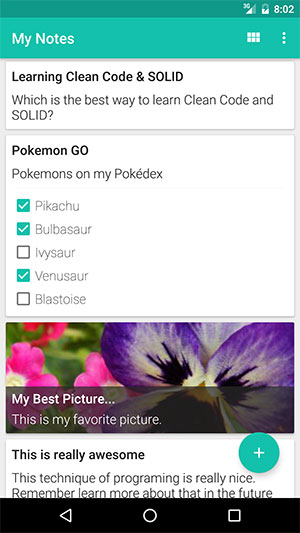
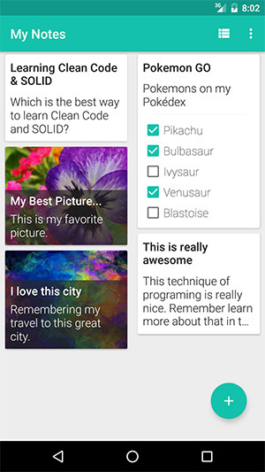
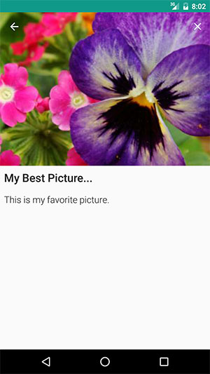
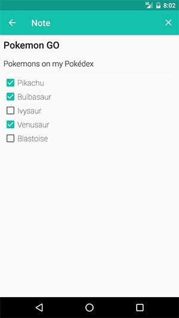

Inheritance Or Composition
==========================

An conceptual sample of how you can build Android Applications using Inheritance and Composition techniques. This repository is the complement of my talk named "Inheritance or Composition, that is the Question" also you can find the slides of that talk, [here](https://speakerdeck.com/txusballesteros/inheritance-or-composition).

## Goal of the Repository

I have created this repository only with learning purposes and I hope that this source-code can helps to another developers to see an alternative way to build their Android applications.

I'm sure that if you're taking a look to this repository, probably you have your self opinion or approach about these concept. Please feel-free to share your opinion or comments in the repository or send your pull request. Will be a pleasure for me, see other opinions or approachs.

## Branches

The repository has two different branches both with the same functionality of the app.

* The first one is the branch named [Inheritance & Legacy](https://github.com/txusballesteros/inheritance_or_composition/tree/inheritance_and_legacy), this branch contains the sourcecode with an approach based on inheritance.

* The second branch named as [Composition](https://github.com/txusballesteros/inheritance_or_composition/tree/composition), contains the sourcecode with an approach based on composition.

## Acknowledgments

Thanks to [Sergio Castillo](https://twitter.com/SergyCastillo) by the application's icon.

## Screenshots

   

## License

Copyright Txus Ballesteros 2016 (@txusballesteros)

This file is part of some open source application.

Licensed to the Apache Software Foundation (ASF) under one
or more contributor license agreements.  See the NOTICE file
distributed with this work for additional information
regarding copyright ownership.  The ASF licenses this file
to you under the Apache License, Version 2.0 (the
"License"); you may not use this file except in compliance
with the License.  You may obtain a copy of the License at

  http://www.apache.org/licenses/LICENSE-2.0

Unless required by applicable law or agreed to in writing,
software distributed under the License is distributed on an
"AS IS" BASIS, WITHOUT WARRANTIES OR CONDITIONS OF ANY
KIND, either express or implied.  See the License for the
specific language governing permissions and limitations
under the License.

Contact: Txus Ballesteros <txus.ballesteros@gmail.com>
